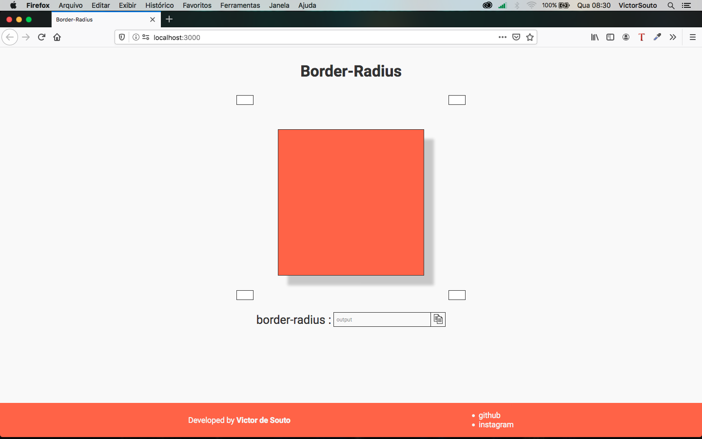

<h1 align="center">
Border Radius
</h1>

<p align="center">
CSS Border Radius generator
</p>

<p align="center">
  <a href="https://opensource.org/licenses/MIT">
    
  </a>
</p>


<p align="center">
    
</p>

## Techs

- ⚛[ReactJS](https://github.com/facebook/react)
- 💾[Redux](https://redux.js.org/introduction/getting-started)
- 💅🏿[Styled Components](https://styled-components.com/)

## Getting Started

- Clone this repository ```git clone ````
- Open the folder ```cd border-radius````
- Install the dependencies ```yarn````
- Start the app ```yarn start```